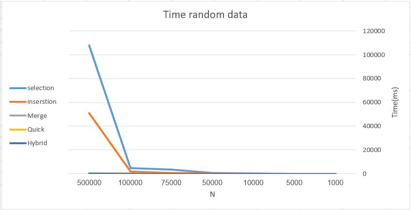

# sorting-algorithms
evaluate the performance of these algorithms and test their performance on large datasets.
The implemented algorithms:
* Selection Sort
* Insertion Sort
* Merge Sort
* Quick Sort
* Hybrid Sort
## 📊 Results

