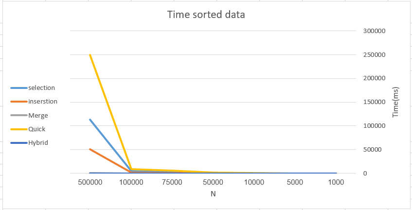

# sorting-algorithms
evaluate the performance of these algorithms and test their performance on large datasets.
The implemented algorithms:
* Selection Sort
* Insertion Sort
* Merge Sort
* Quick Sort
* Hybrid Sort
## 📊 Results


## 💻 Build with
* c++
* python (to generate random data)
## 🏁 Get Started
Generate Random Data (for example generate 100 numbers in data.txt file)
```
python runscript.py 100 data.txt
```
Compile
```
g++ -O2 sort.cpp
```
Run
```
a.exe 0 data.txt sorted_data.txt running_data.txt
```
